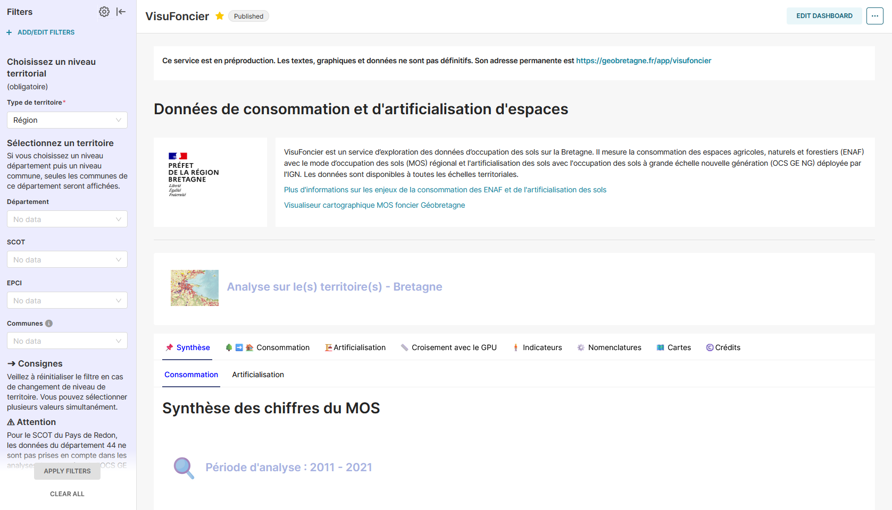
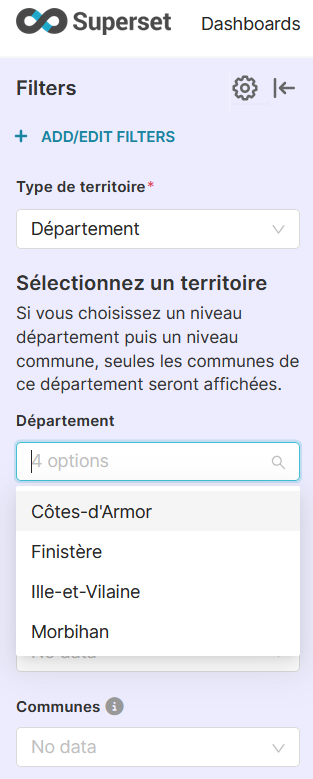

# Documentation de l'outil Visufoncier

## Étape 1 : Accéder à l'outil
Cliquez sur ce lien pour accéder à l'outil Visufoncier : [Visufoncier](https://geobretagne.fr/app/visufoncier)

## Étape 2 : Choisir l'échelle d'analyse
Sélectionnez le niveau d'analyse souhaité :
- Régional
- Départemental
- Communal
- EPCI (Établissement Public de Coopération Intercommunale)
- SCOT (Schéma de Cohérence Territoriale)

## Étape 3 : Sélectionner votre territoire
Choisissez votre territoire (département, région, commune, EPCI ou SCOT). Vous pouvez sélectionner plusieurs territoires à la fois. 
**Remarque :** Les données disponibles se limitent à la région Bretagne.
- Pour l'OCS GE NG, l'accès aux données du Morbihan n'est pas disponible pour le moment.
- Pour le SCOT du Pays de Redon, les données du 44 ne sont pas accessibles.

## Étape 4 : Appliquer les filtres
Cliquez sur le bouton **Apply Filter** pour appliquer vos sélections. Par exemple, vous pouvez :
1. Sélectionner un département, comme le Finistère.
2. Revenir au niveau territorial et choisir **Commune** pour afficher uniquement les communes du Finistère dans la liste.

Vous pouvez choisir plusieurs territoires simultanément, mais attention à ne pas appliquer des filtres incompatibles. Pour supprimer tous les filtres, cliquez sur le bouton **Clear All**.  
Pour l'onglet carte, il est recommandé d'être filtré sur un niveau communal et une commune spécifique.

## Étape 5 : Explorer les données
Parcourez les onglets pour découvrir les chiffres du MOS et de l'OCS GE NG. Vous aurez également accès à des données de consommation provenant des fichiers fonciers du CEREMA, ainsi qu'aux données de l'INSEE telles que la population, l'emploi, les ménages et la densité. De plus, vous pourrez consulter les documents d'urbanisme tels que les PLU, cartes communales et zones de prescription.

### Cartographies et visualisations
Accédez à plusieurs cartographies et visualisations en ligne via GeoBretagne : [GeoBretagne MViewer](https://geobretagne.fr/mviewer/?config=/apps/mos/config.xml)

---
